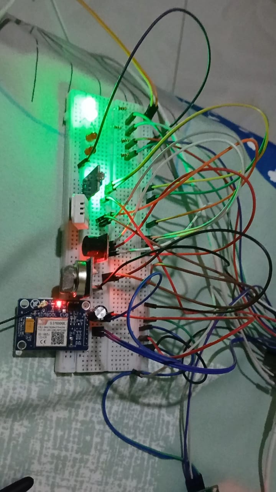
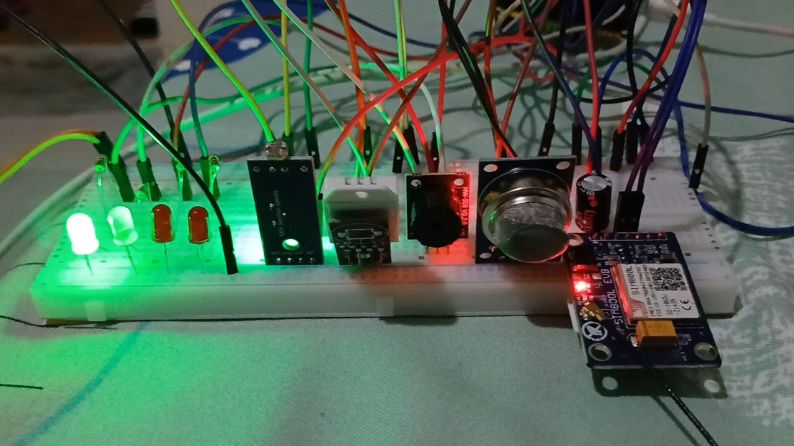
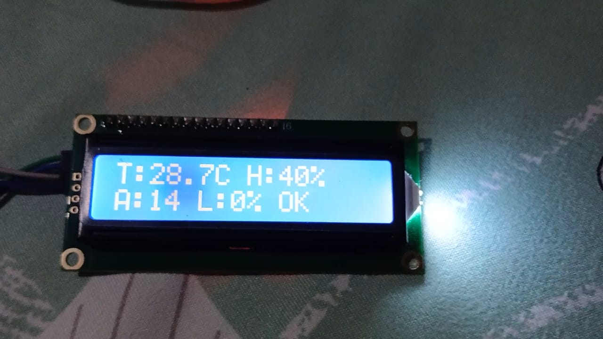
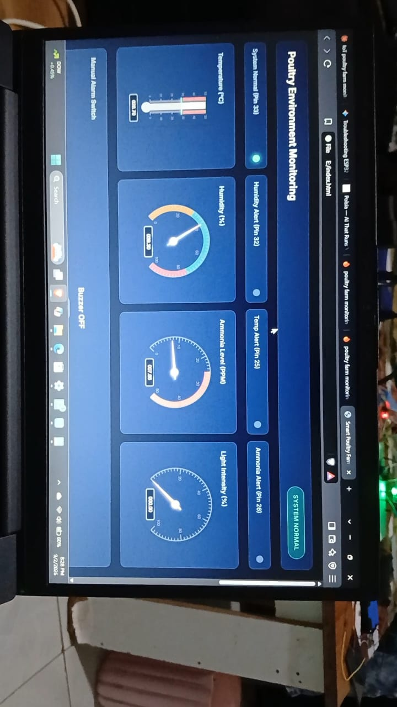

# 🐔 IoT-Based Poultry Farm Monitoring System

An ESP32-based IoT system for monitoring environmental conditions inside a poultry house and sending real-time sensor data to Firebase.

The system is designed to help monitor important environmental conditions such as **temperature, humidity, ammonia-related air quality, and light levels**, while providing local visual and audible alerts.

> **Project status:** Active development
> **Current release:** `v1.0.0`

---

## 📌 Overview

Maintaining suitable environmental conditions is important for poultry health and farm management. This project uses an **ESP32 microcontroller** together with environmental sensors to continuously monitor conditions inside a poultry house.

Sensor readings are displayed locally on a **16×2 I2C LCD** and transmitted to **Firebase** for remote monitoring.

The system also provides local alerts using LEDs and a buzzer when monitored conditions exceed configured thresholds.

The project is intended as an open-source platform that can be extended with additional sensors, automation, dashboards, notifications, and farm-management features.

---

## ✨ Features

* 🌡️ Real-time temperature monitoring
* 💧 Humidity monitoring
* 🧪 MQ-135-based air-quality/ammonia monitoring
* 💡 Light-level monitoring using an LDR
* 📟 Local display using a 16×2 I2C LCD
* ☁️ Firebase integration for remote monitoring
* 🚨 Local visual alerts using LEDs
* 🔊 Audible alerts for temperature and ammonia conditions
* 📡 ESP32 Wi-Fi connectivity
* 📱 Remote sensor-data availability through Firebase
* 🔧 Modular firmware structure for future expansion
* ## 📷 Project Photos

### 🐔 System Prototype

The completed IoT-based poultry farm monitoring prototype integrates the ESP32 controller, environmental sensors, LCD display, indicators, buzzer, and communication components.



---

### 🌡️ Sensor Setup

The sensor section of the system is used to monitor important poultry-house environmental conditions, including temperature, humidity, air quality/ammonia level, and light.



---

### 📟 LCD Monitoring Display

The 16×2 I2C LCD provides a local view of the monitored environmental conditions and system status.



---

### 📊 Monitoring Dashboard

The monitoring dashboard provides a remote view of sensor readings and system status through the IoT platform.



---

## 🏗️ System Architecture

```text
                 ┌─────────────────────┐
                 │       ESP32         │
                 │   Main Controller   │
                 └──────────┬──────────┘
                            │
          ┌─────────────────┼─────────────────┐
          │                 │                 │
          ▼                 ▼                 ▼
      ┌────────┐        ┌────────┐        ┌────────┐
      │ DHT22  │        │ MQ-135 │        │  LDR   │
      │ Temp & │        │  Air / │        │ Light  │
      │Humidity│        │Ammonia │        │ Level  │
      └────────┘        └────────┘        └────────┘
          │                 │                 │
          └─────────────────┼─────────────────┘
                            │
                            ▼
                     ┌─────────────┐
                     │   ESP32     │
                     │ Processing  │
                     └──────┬──────┘
                            │
             ┌──────────────┼──────────────┐
             │              │              │
             ▼              ▼              ▼
        ┌─────────┐    ┌──────────┐   ┌──────────┐
        │   LCD   │    │ LEDs +   │   │ Firebase │
        │ 16×2    │    │ Buzzer   │   │  Cloud   │
        └─────────┘    └──────────┘   └──────────┘
```

---

## 🔧 Hardware

| Component            | Purpose                                         |
| -------------------- | ----------------------------------------------- |
| ESP32-32D DevKitC V4 | Main microcontroller                            |
| DHT22                | Temperature and humidity measurement            |
| MQ-135               | Air-quality/ammonia-related monitoring          |
| LDR module           | Light-level monitoring                          |
| 16×2 I2C LCD         | Local information display                       |
| Red LED ×2           | Temperature and ammonia alerts                  |
| Yellow LED           | Humidity warning                                |
| Green LED            | Normal system status                            |
| Active buzzer        | Audible temperature/ammonia alert               |
| SIM800L V2.0         | GSM fallback in the dual-communication firmware |

---

## 📍 GPIO Configuration

|    GPIO | Component     | Function                   |
| ------: | ------------- | -------------------------- |
|  GPIO 4 | DHT22         | Temperature/humidity data  |
| GPIO 34 | MQ-135        | Analog air-quality reading |
| GPIO 35 | LDR           | Analog light reading       |
| GPIO 21 | LCD           | I2C SDA                    |
| GPIO 22 | LCD           | I2C SCL                    |
| GPIO 14 | SIM800L       | GSM serial connection      |
| GPIO 27 | SIM800L       | GSM serial connection      |
| GPIO 25 | Red LED 1     | Temperature alert          |
| GPIO 26 | Red LED 2     | Ammonia alert              |
| GPIO 32 | Yellow LED    | Humidity warning           |
| GPIO 33 | Green LED     | Normal system status       |
| GPIO 23 | Active buzzer | Temperature/ammonia alarm  |

### LCD

The LCD uses I2C address:

```text
0x27
```

---

## 🚨 Alert Logic

The current firmware uses the following configured thresholds:

| Parameter           | Alert condition                |
| ------------------- | ------------------------------ |
| Temperature         | Above `30.0 °C`                |
| Humidity            | Above `75.0%` or below `40.0%` |
| Ammonia             | Above `25.0 ppm`               |
| Monitoring interval | 30 seconds                     |

### Indicator behavior

* 🔴 **Red LED 1** → Temperature alert
* 🔴 **Red LED 2** → Ammonia alert
* 🟡 **Yellow LED** → Humidity outside configured range
* 🟢 **Green LED** → Monitored parameters are normal
* 🔊 **Buzzer** → Temperature or ammonia alert

> Thresholds are configurable in the firmware and should be calibrated according to the actual farm environment and sensor characteristics.

---

## ☁️ Firebase Integration

The system sends monitored information to Firebase using the ESP32's Wi-Fi connection.

The current database structure includes:

```text
/sensors/temperature
/sensors/humidity
/sensors/ammonia_ppm
/sensors/light
/sensors/status
/alerts/latest
```

This structure can be extended to support historical data, dashboards, notifications, analytics, and additional sensors.

---

## 📁 Repository Structure

```text
iot-poultry-farm-monitor/
│
├── firmware/
│   └── poultry_monitor/
│       ├── poultry_monitor_latest_recovered.ino
│       └── poultry_monitor_firebase_only.ino
│
├── libraries/
│   └── required_libraries.txt
│
├── docs/
│   └── recovery_notes.md
│
├── .gitignore
└── README.md
```

### Firmware versions

#### `poultry_monitor_latest_recovered.ino`

This is the latest complete firmware recovered from the original project conversation. It contains the Wi-Fi, Firebase, LCD, sensors, LEDs, buzzer, and SIM800L GSM fallback functionality.

#### `poultry_monitor_firebase_only.ino`

This is the Firebase-only derivative prepared from the recovered firmware, with the GSM fallback removed.

---

## 🛠️ Software Requirements

You will need:

* Arduino IDE
* ESP32 board support package
* A configured Firebase project
* Wi-Fi network
* The libraries listed in:

```text
libraries/required_libraries.txt
```

---

## 🚀 Getting Started

### 1. Clone the repository

```bash
git clone https://github.com/Davidjames412294/iot-poultry-farm-monitor.git
```

### 2. Open the firmware

Navigate to:

```text
firmware/poultry_monitor/
```

Open the appropriate `.ino` file using Arduino IDE.

### 3. Install the required libraries

Install the libraries listed in:

```text
libraries/required_libraries.txt
```

### 4. Configure Wi-Fi

Add your local Wi-Fi credentials to the firmware using your own local configuration.

### 5. Configure Firebase

Create/configure your Firebase project and add the required Firebase configuration to the firmware.

### 6. Select the ESP32 board

Select the appropriate ESP32 board and COM port in Arduino IDE.

### 7. Upload

Compile and upload the firmware to the ESP32.

### 8. Monitor the system

After startup:

* Sensor values should be read by the ESP32.
* Data should be displayed on the LCD.
* Firebase should receive the configured sensor values.
* LEDs should indicate the current environmental state.
* The buzzer should activate for configured temperature or ammonia alerts.

---

## 🔐 Security

**Never publish private credentials in this repository.**

Do not commit:

* Wi-Fi passwords
* Firebase private keys
* API secrets
* Authentication tokens
* Private phone numbers
* Other sensitive credentials

Use local configuration files or environment-specific configuration instead.

The public repository should contain only safe placeholders.

---

## 🧪 Calibration and Limitations

The sensors used in this project may require calibration for accurate measurements.

In particular, MQ-series gas sensors can be affected by environmental conditions and should not automatically be treated as laboratory-grade ammonia measurement instruments.

Before deploying the system in a real poultry house, sensor readings and alert thresholds should be tested and calibrated under the intended operating conditions.

---

## 🔮 Future Development

Planned or possible improvements include:

* 📊 Web-based Firebase dashboard
* 📱 Mobile monitoring application
* 📈 Historical sensor graphs
* 🔔 Remote notifications
* 🐔 Additional poultry-house sensors
* 🌬️ Automatic ventilation control
* 💡 Automatic lighting control
* 🌡️ Automatic temperature control
* 💧 Water and feed-level monitoring
* 🗃️ Long-term environmental data storage
* 🔐 Improved Firebase authentication
* 🧪 Improved sensor calibration
* 🛠️ Better fault detection and recovery
* 📡 Additional communication options

---

## 🤝 Contributing

Contributions and suggestions are welcome.

If you find a problem or have an improvement:

1. Open an **Issue** describing the problem or proposed feature.
2. Fork the repository.
3. Create a feature branch.
4. Make your changes.
5. Test the changes.
6. Submit a Pull Request.

Example:

```bash
git checkout -b feature/new-sensor
```

---

## 📜 License

This project is intended for educational and open-source development.

A specific open-source license should be added to the repository before redistributing the project under formal open-source licensing terms.

---

## 👨‍💻 Project

**IoT-Based Poultry Farm Monitoring System**

Developed as an electronics, telecommunications, IoT, and embedded-systems project using the ESP32 platform.

**Repository:**
https://github.com/Davidjames412294/iot-poultry-farm-monitor

---

## ⭐ Project Status

**Version:** `v1.0.0`

The project is under active development. Hardware testing, firmware improvements, Firebase integration, documentation, and additional automation features may continue to evolve.
